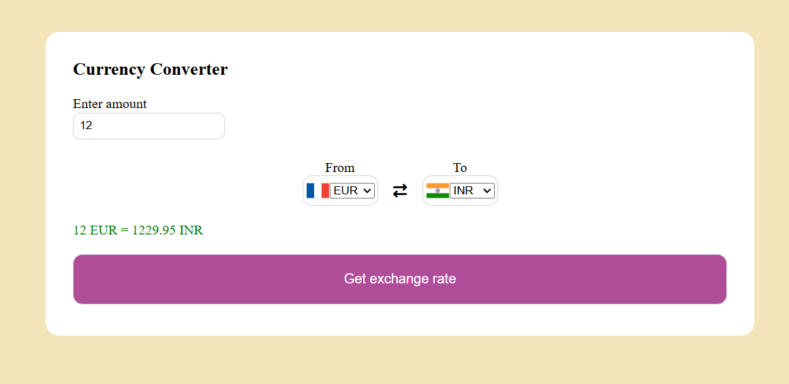

README.md
# Currency Converter

A simple and responsive **Currency Converter Web App** built using **HTML, CSS, and JavaScript**, powered by the **[FreeCurrencyAPI](https://freecurrencyapi.com)**.  
It allows users to convert between different currencies in real time using accurate live exchange rates.

---

## Features

- Real-time currency conversion using **FreeCurrencyAPI**  
- Supports multiple currencies (USD, INR, EUR, GBP, JPY, and more)  
- Instant conversion without page reload    
- Clean, minimal, and responsive website  

---

## Technologies Used

| Component | Technology |
|------------|-------------|
| Frontend | HTML5, CSS3, JavaScript |
| API Provider | [FreeCurrencyAPI](https://freecurrencyapi.com) |
| Flags| [FlagsAPI](https://flagsapi.com) |
| Version Control | Git & GitHub |

---

## Setup Instructions

### 1️⃣ Clone the Repository
```bash
git clone https://github.com/<your-username>/currency-converter.git
```
2️⃣ Create a config.js File
In the project root, create a file named config.js and add:
```bash
const API_KEY = "your_freecurrencyapi_key_here";
```

⚠️ Important:
Add config.js to your .gitignore file to keep your API key private.

3️⃣ Open the App

Simply open index.html in your browser,
or run a lightweight development server (recommended):
```bash
npx live-server
```

---
**Preview**

(You can add a screenshot later, e.g. screenshot.png)



---

**📜 License:**
MIT License

---

**Credits**

- Exchange rate data powered by FreeCurrencyAPI

- Flags provided by FlagsAPI

- 💻 Developed by avkhalkar

---

**🤝 Contributing**

Pull requests are welcome!
For major changes, please open an issue first to discuss what you’d like to modify.

**Acknowledgments**

Special thanks to FreeCurrencyAPI for providing accurate and reliable exchange rate data that powers this project.


---

**Instructions**:
1. Copy everything above and save it as `README.md` in your project root.  
2. Replace `<your-username>` with your actual GitHub username.   

---